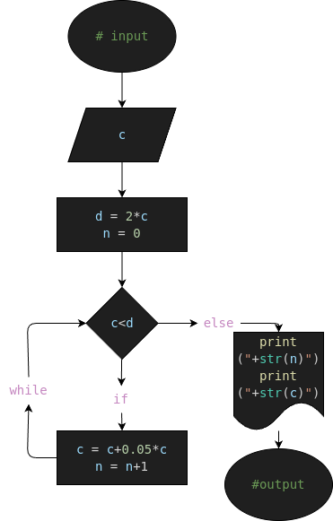

# Caso No.2 capital_mensual_quote
Programa en Python para calcular en cuantos meses aproximados la Capital (DINERO) ingresada estara duplicada al... doble (nimodo que al triple no?-)

## Analisis

### Variable de Entrada (#input)
- c= Capital (DINERO)

### Procesamiento (#processing)
- d= 2*c
- n= 0
---
- while(c<d):
    - c = c+0.05*c
    - n = n+1

## Diseño

## Construccion

- Codigo implementado en el archivo "capital_mensual_quote.py"